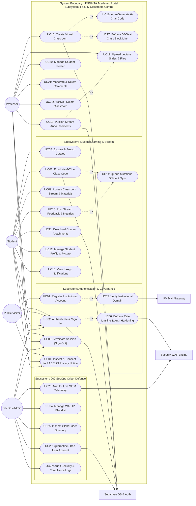
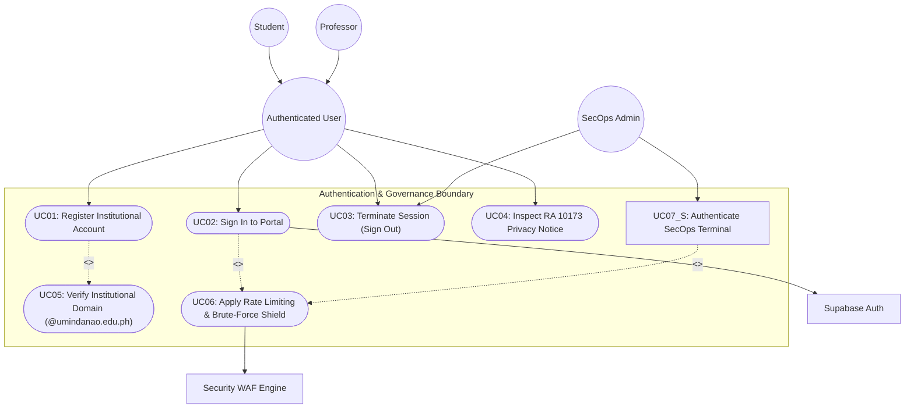
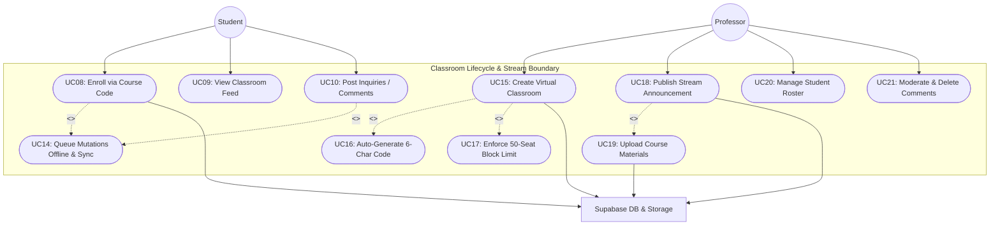
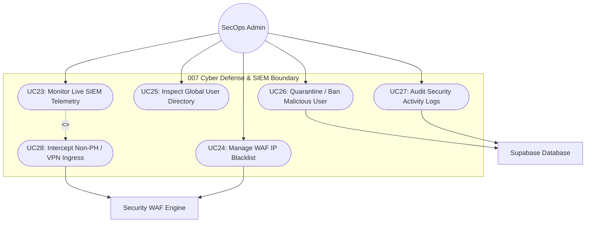

# UMINIKTA UML Use Case Diagram & System Specifications
**Project:** UMINIKTA (Unified Academic Continuity, Classroom Collaboration & Cybersecurity Platform)  
**Institution:** University of Mindanao — College of Computing Education (CCE)  
**Course Code:** IT12 (Systems Analysis, Design & Implementation)  
**Version:** 1.0.0  
**Compliance Standard:** ISO/IEC 19505-2 (OMG Unified Modeling Language v2.5.1) & Republic Act No. 10173 (Philippine Data Privacy Act)

---

## 1. System Overview & Scope

**UMINIKTA** is an institutional multi-campus academic continuity and classroom collaboration portal engineered specifically for the **University of Mindanao** (Matina, Visayan, and Arellano campuses). The system bridges student learning, faculty control desks, and automated **007 Cybersecurity WAF** threat telemetry under strict institutional governance.

### System Boundaries
- **In-Scope:**
  - Multi-campus role-based authentication restricted to `@umindanao.edu.ph` institutional emails.
  - Virtual classroom lifecycle: creation, 6-character code enrollment, seat capacity enforcement (max 50).
  - Academic streams: real-time announcement authoring, document attachments, discussion moderation.
  - Student assignment management and submission tracking.
  - Offline-first resilience: local queueing of database mutations when network connectivity drops.
  - SecOps SIEM operations: automated packet telemetry, WAF rule enforcement, and account moderation.
  - Statutory compliance with Republic Act No. 10173 (Philippine Data Privacy Act).
- **Out-of-Scope:**
  - Direct processing of bank tuition payments (handled by University Cashier).
  - External non-institutional user guest accounts.

---

## 2. Actor Descriptions

| Actor Name | Type | Description |
| :--- | :--- | :--- |
| **Public Visitor** | Human (External) | Prospective students or unregistered campus members accessing public informational landing pages and RA 10173 notices. |
| **Student** | Human (Primary) | Enrolled University of Mindanao student accessing course feeds, joining classes with course codes, submitting work, and receiving announcements. |
| **Professor / Faculty** | Human (Primary) | University of Mindanao faculty member creating virtual classrooms, authoring announcements, uploading materials, and managing rosters. |
| **SecOps Administrator** | Human (Administrative) | University cybersecurity engineer monitoring SIEM event telemetry, managing WAF IP blacklists, and quarantining malicious users. |
| **Security WAF Engine** | Automated System | Embedded threat mitigation filter intercepting SQL injection, XSS probes, rapid bot requests, and non-PH IP traffic. |
| **Supabase Cloud Infrastructure** | External Service | PostgreSQL relational database, Row-Level Security (RLS) enforcement, and encrypted document storage buckets. |
| **Institutional Mail Gateway** | External Service | University of Mindanao SMTP infrastructure delivering verification and notification messages. |

---

## 3. High-Level UML Use Case Diagram

---

## 4. Subsystem Detailed Use Case Diagrams

### 4.1 Authentication & Institutional Governance Subsystem

### 4.2 Classroom Collaboration & Content Stream Subsystem

### 4.3 007 SecOps Cyber Defense & Telemetry Subsystem

---

## 5. Detailed Use Case Specifications

### UC01: Register Institutional Account
- **Primary Actor:** Student, Professor
- **Pre-conditions:** The user does not possess an active account and has access to an official University of Mindanao email (`@umindanao.edu.ph`).
- **Post-conditions:** User record created in `auth.users` and automatically replicated into `public.users` via database trigger `on_auth_user_created`.
- **Main Success Scenario:**
  1. User accesses the UMINIKTA Authentication Portal and toggles to the **Register Account** panel.
  2. User selects their institutional role (**Student** or **Professor**) and assigned campus (**Matina**, **Visayan**, or **Arellano**).
  3. User enters Full Name, Student/Employee ID Number, Institutional Email, and Security Password (min 6 chars).
  4. System validates that the email ends with `@umindanao.edu.ph` (`<<include>> UC05`).
  5. System triggers Supabase Auth registration.
  6. Database trigger creates the public profile with the assigned role.
  7. User is notified of account creation and automatically redirected to their role dashboard.
- **Extensions / Exceptions:**
  - *4a. Non-Institutional Email:* If email is external (e.g. `@gmail.com`), system halts registration with alert: `"You must register with a valid @umindanao.edu.ph institutional email address."`
  - *4b. Duplicate Account:* If email already exists, system displays conflict error.

---

### UC02: Authenticate & Sign In
- **Primary Actor:** Student, Professor, SecOps Administrator
- **Pre-conditions:** User possesses registered credentials and their account is not flagged as banned (`is_banned = false`).
- **Post-conditions:** JWT session token securely persisted in client storage (`SecureStore` on Native, `AsyncStorage` on Web); user routed to respective role cockpit.
- **Main Success Scenario:**
  1. User inputs email and password into the Sign In panel.
  2. WAF checks IP address for rate-limiting violations (`<<extend>> UC06`).
  3. System sends credentials to Supabase Auth.
  4. System fetches `public.users` record to evaluate `role` and `is_banned` flag.
  5. System records successful authentication event in `ActivityLogger`.
  6. Router executes instant role redirection:
     - `student` $\rightarrow$ `/(student)`
     - `professor` $\rightarrow$ `/(professor)`
     - `secops` $\rightarrow$ `/(secops)`
- **Extensions / Exceptions:**
  - *4a. Account Banned:* If `is_banned === true`, router immediately routes user to `/banned` and terminates session.
  - *4b. Invalid Credentials:* Alert displayed; failed attempt logged.

---

### UC08: Enroll via 6-Character Course Code
- **Primary Actor:** Student
- **Pre-conditions:** Student is logged in; possesses valid 6-character code (e.g. `CS101A`) issued by the course professor.
- **Post-conditions:** New record created in `enrollments` table linking `student_id` to `subject_id`.
- **Main Success Scenario:**
  1. Student enters 6-character code into Quick Join Box (on Landing Page or Student Dashboard).
  2. System queries `subjects` table where `code = enteredCode`.
  3. System verifies subject exists and current enrollment count is $< 50$ (class block limit).
  4. System checks if student is already enrolled.
  5. System creates enrollment record.
  6. Class feed is immediately mounted in student dashboard.
- **Extensions / Exceptions:**
  - *3a. Class Full (50 seats reached):* System displays alert: `"Class Capacity Reached: This class has reached its institutional limit of 50 students."`
  - *4a. Already Enrolled:* System alerts: `"Already Enrolled: You are already a member of this classroom."`
  - *5a. Offline Status:* If offline, mutation is intercepted and stored in `offlineQueue` (`<<extend>> UC14`).

---

### UC15: Create Virtual Classroom
- **Primary Actor:** Professor
- **Pre-conditions:** Professor is authenticated with active faculty credentials.
- **Post-conditions:** New subject entry in `subjects` with auto-generated unique 6-character alphanumeric code and `professor_id`.
- **Main Success Scenario:**
  1. Professor clicks **+ Create Class** on the Faculty Dashboard.
  2. Professor enters Course Name (e.g., `"CS 311: Software Engineering"`).
  3. System invokes code generator to create a unique 6-character code (`<<include>> UC16`).
  4. System sets maximum capacity to 50 seats (`<<include>> UC17`).
  5. System persists class in Supabase database.
  6. Professor can now copy the code to share with students.

---

### UC18: Publish Stream Announcement
- **Primary Actor:** Professor
- **Pre-conditions:** Professor is inside an active subject feed.
- **Post-conditions:** Post record created in `posts` table with title, body text, timestamp, and optional file link.
- **Main Success Scenario:**
  1. Professor clicks **Post Announcement** or navigates to `/create-post`.
  2. Professor specifies post type (`announcement` or `activity`), title, and content.
  3. Professor optionally uploads PDF or image material (`<<extend>> UC19`).
  4. System saves post record.
  5. Real-time Supabase subscription triggers immediate push notification to all enrolled students.

---

### UC23: Monitor Live SIEM Telemetry & 007 Defense
- **Primary Actor:** SecOps Administrator
- **Pre-conditions:** SecOps administrator authenticated with administrative privileges.
- **Post-conditions:** Live telemetry view maintained via Supabase PostgreSQL realtime channel.
- **Main Success Scenario:**
  1. SecOps opens `/(secops)` dashboard.
  2. System queries latest 50 entries from `siem_traffic_logs`.
  3. System establishes WebSocket subscription on `siem_traffic_logs` table.
  4. Real-time KPI counters update dynamically:
     - Threats Blocked
     - Clean Traffic Ratio
     - VPN / Proxy Interceptions
  5. SecOps inspects suspicious packet payloads and origins.

---

### UC26: Quarantine / Ban User Account
- **Primary Actor:** SecOps Administrator
- **Pre-conditions:** SecOps administrator identifies malicious actor via SIEM logs or user directory.
- **Post-conditions:** Target user `is_banned` field set to `true`; any active session immediately invalidated.
- **Main Success Scenario:**
  1. SecOps navigates to **Global Directory** (`/GlobalDirectory`).
  2. SecOps locates suspicious user account via real-time search.
  3. SecOps clicks **Quarantine / Ban User**.
  4. System updates `public.users` row setting `is_banned = true`.
  5. Target user's client detects state on next interaction and forces redirect to `/banned`.
  6. Ban event recorded in `ActivityLogger`.

---

## 6. Use Case Traceability Matrix

| Use Case ID | Use Case Name | Primary Actor | Frontend Controller / Screen | Backend / DB Entity |
| :--- | :--- | :--- | :--- | :--- |
| **UC01** | Register Institutional Account | Student, Professor | [`AuthSlidingContainer.js`](./src/components/AuthSlidingContainer.js) | `auth.users`, `public.users` |
| **UC02** | Authenticate & Sign In | All Roles | [`AuthSlidingContainer.js`](./src/components/AuthSlidingContainer.js) | `supabase.auth.signInWithPassword` |
| **UC03** | Terminate Session | All Roles | [`AuthContext.js`](./src/context/AuthContext.js) | `supabase.auth.signOut` |
| **UC04** | Inspect RA 10173 Notice | All Roles | [`PrivacyNoticeModal.js`](./src/components/PrivacyNoticeModal.js) | Statutory Documentation |
| **UC05** | Verify UM Domain | System | [`AuthSlidingContainer.js`](./src/components/AuthSlidingContainer.js) | Domain Validation Rule |
| **UC06** | Enforce Rate Limiting | WAF System | [`SecurityWAF.js`](./src/utils/SecurityWAF.js) | `siem_traffic_logs` |
| **UC07** | Browse Catalog | Student | [`explore.js`](./app/(student)/explore.js) | `subjects`, `enrollments` |
| **UC08** | Enroll via Code | Student | [`(student)/index.js`](./app/(student)/index.js) | `enrollments` table |
| **UC09** | Access Class Stream | Student | [`(student)/subject/[id].js`](./app/(student)/subject/[id].js) | `posts`, `subjects` |
| **UC10** | Post Stream Feedback | Student | [`(student)/subject/[id].js`](./app/(student)/subject/[id].js) | `comments` table |
| **UC12** | Manage Profile | Student | [`(student)/profile.js`](./app/(student)/profile.js) | `public.users` storage |
| **UC14** | Offline Mutation Queue | System | [`offlineQueue.js`](./src/utils/offlineQueue.js) | `AsyncStorage` Queue |
| **UC15** | Create Classroom | Professor | [`(professor)/index.js`](./app/(professor)/index.js) | `subjects` table |
| **UC18** | Publish Announcement | Professor | [`create-post.js`](./app/(professor)/create-post.js) | `posts` table |
| **UC19** | Upload Course Materials | Professor | [`create-post.js`](./app/(professor)/create-post.js) | Supabase Storage Bucket |
| **UC20** | Manage Roster | Professor | [`(professor)/subject/[id].js`](./app/(professor)/subject/[id].js) | `enrollments` table |
| **UC23** | Monitor SIEM Telemetry | SecOps | [`(secops)/index.js`](./app/(secops)/index.js) | `siem_traffic_logs` table |
| **UC24** | Manage WAF Blacklist | SecOps | [`WAFBlacklist.js`](./src/components/secops/WAFBlacklist.js) | `waf_blacklist` table |
| **UC25** | Inspect User Directory | SecOps | [`GlobalDirectory.js`](./src/components/secops/GlobalDirectory.js) | `public.users` table |
| **UC26** | Quarantine Malicious User | SecOps | [`GlobalDirectory.js`](./src/components/secops/GlobalDirectory.js) | `public.users.is_banned` |
| **UC27** | Audit Activity Logs | SecOps | [`ActivityLogger.js`](./src/utils/ActivityLogger.js) | `audit_logs` table |
